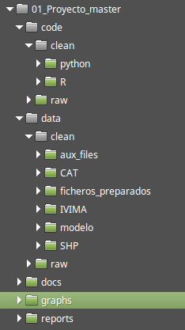

# Estimación precio alquiler en Madrid.  

***

### (Trabajo Fin de Master Data Science Kschool. Manuel Maestre Rodríguez)  
### Octubre 2016

## Objetivo del estudio.

El estudio tiene por finalidad estimar el precio del alquiler de la vivienda en Madrid. Para ello se utilizarán las siguientes fuentes de datos:

   * Datos catastrales de Madrid, obtenidos del catastro
   * Datos del precio de alquiler en Madrid, obtenidos de IVIMA
   * Información gráfica en formato "shape" de los barrios de Madrid

## Descripción de los datos utilizados

### Datos catastrales

Los datos catastrales se pueden descargar de la [web de catastro](https://www.sedecatastro.gob.es/OVCFrames.aspx?TIPO=TIT&a=masiv), accesibles con certificado digital, dentro de la sección descarga de información alfanumérica.

Los datos catastrales se procesarán para obtener la información de las viviendas de Madrid, relativa a:

* localización de las viviendas tanto alfanumérica (dirección) como geolocalización (coordenadas x,y)
* superficie
* presencia de garaje
* altura
* antigüedad

### Datos con precios de alquiler

Para obtener los precios de alquiler de un conjunto de viviendas de Madrid, se utilizarán los datos del IVIMA (Instituto de la vivienda de Madrid), alojados en [plan alquila](http://www.planalquila.org/).
Este conjunto de datos contiene información de:

* localización de las viviendas
* superficie
* presencia de garaje
* altura
* supercifie
* precio de alquiler

### Datos y geolocalización de barrios de Madrid

Se utiliza también una capa _shape_ con la geolocalización de los barrios de Madrid, alojada en [barrios Madrid](http://www.madrid.org/nomecalles/DescargaBDTCorte.icm), sección _Delimitaciones territoriales_, fichero _Barrios Madrid._

Este fichero se utilizará para asociar el barrio a cada una de las viviendas, así como para la representación del cuadro de mando final.

### Enriquecimiento y relación entre fuentes de datos

Con la finalidad de que el modelo predictivo sea lo más ajustado posible, se enriquecerán las distintas fuentes de información disponibles, añadiendo la siguiente información a cada una de ellas:

* datos catastrales. Barrio desde el shape de barrios
* datos IVIMA. Coordenadas (x,y), y antigüedad desde catastro; Barrio desde el shape de barrios

## Estructura de ficheros y directorios

Para el correcto funcionamiento del código, se ha definido estructura de directorios en la que se alojarán los distintos ficheros de datos, código y resultados. Dicha estructura se refleja en la siguiente imagen:

Para facilitar la replicabilidad del estudio además del repositorio de github, se pueden descargar tanto la estructura de directorios con los datos y el código sin ejecutar de:

__AÑADIR ENLACE A ESTRUCTURA CLEAN__

como el proyecto completo: la estructura de directorios, los datos originales y los ficheros creados por el código ejecutado de:

__AÑADIR ENLACE A ESTRUCTURA COMPLETA__

## Descripción del código

El código para obtener los datos finales del estudio se ha dividido en varios ficheros de Python y R, cuya ejecución secuencial se detalla a continuación.

Para ejecutar el código será necesario tener instalado en el sistema Python y R. El estudio se ha realizado sobre el SO Linux, por lo que para su ejecución en otros SO habrá que adaptar las partes del código que hacen referencia a las rutas de ficheros.

## Python

Los ficheros de código de Python se encuentran en ./code/clean/Python, están escritos para ejecutarse en un notebook de python, este orden:

### 01_separar_ficheros_CAT_tipos.ipynb

Este script toma los ficheros de datos de catastro que estén en el directorio ./data/raw/CAT/pendientes y los separa en los tipos descritos en el documento [descripción catastro](http://www.catastro.minhap.es/documentos/formatos_intercambio/catastro_fin_cat_2006.pdf), que serán utilizados para obtener la información de viviendas de Madrid . Procesa dichos ficheros, generando 3 ficheros (tipo11, tipo15 y tipo14) en el directorio .data/clean/CAT/. Mueve los ficheros originales de catastro a ./data/raw/CAT/procesados para evitar reprocesos en ejecuciones posteriores.
Para ellos son necesarios los ficheros de esquema que describen los campos a extraer, alojados en ./data/clean/aux_files

Aunque sólo se van a utilizar los datos de catastro de Madrid, el script está preparado para procesar otros ficheros de diferentes municipios que pudiesen alojarse en el directorio de datos de entrada.

Este script utiliza la librería [csv toolkit](https://csvkit.readthedocs.io/en/0.9.1/) que deberá estar instalada en el sistema.

### 02_Crear_ficheros_enriquecidos_t15.ipynb

Este script utiliza los ficheros creados en el paso anterior, ubicados en .data/clean/CAT/ para crear un único fichero de salida que contiene la información de viviendas de catastro con la información enriquecida procedente de los diferentes ficheros generados en el punto anterior, y que va a ser utilizada posteriormente para generación del modelo de estimación.

Finalmente mueve los ficheros de catastro utilizados a .data/clean/CAT/procesados para evitar reprocesos en ejecuciones posteriores.

Al igual que el script anterior, podrían procesarse varios municipios de catastro.

### 03_Procesar_datos_IVIMA.ipynb

El tercer script de Python une los distintos ficheros con los datos de alquiler descargados de [IVIMA](http://www.planalquila.org/) y enriquece esta información con los datos necesarios de catastro. Para ello es necesario realizar un cruce por literales de calle, normalizando las direcciones de IVIMA a las de catastro, en esta fase hay una comprobación y corrección manual de aquellos tipos de vía que no se pueden asociar de forma directa.

## R 

Los ficheros de código de R se encuentran en ./code/clean/R, la ejecución del código debe realizarse en este orden:

### 01_Cruce_calles_fecha_edificios.R

La finalidad de este código es asociar los literales de calle, tanto el tipo de vía como el nombre de la calle de catastro e IVIMA de forma que se puedan poblar en IVIMA los datos adicionales procedente de catastro.
Además de los ficheros generados en pasos anteriores se utiliza también como entrada el fichero de catastro que añade la descripción del tipo de vía al identificador de tipo de vía, que se puede obtener en [tipos de via catastro](http://fpe.hazi.es/datos/files/cursos/10006_4.pdf), pág 42. Este listado en formato texto, separado por ";" está ubicado en ./data/clean/CAT/tipo_via_cat.csv.

Los literales de nombre de calle que no coinciden exactamente, se _"rankean"_ calculando la distancia de Levenstein al resto de calles, seleccionando manualmente las coincidencias. Se realizan tres iteraciones de revisión manual de coincidencias. Si no se ha realizado una comprobación manual previa, tras las revisiones se crea un fichero de salida para evitar este proceso manual en futuras ejecuciones, de lo contrario se evitan las comprobaciones manuales y se carga el fichero ya existente. Si hay coincidencia de literales, se pondrá un 1 en la última celda de la tabla que se abre, de lo contrario se codificará con un 0. Por defecto todas las asociaciones aparecen marcadas a 1 y hay que codificar manualmente a 0 aquellas en las que no haya coincidencia.

Posteriormente se obtiene el nombre e id del barrio al que pertenecen las fincas tanto de IVIMA como de catastro, cruzando las coordenadas de las mismas con el shape de barrios, guardado en '/SHP/Barrios Madrid/200001465.shp'

Como último paso se generan los ficheros con los datos enriquecidos de fincas de IVIMA y catastro, guardándolos en /data/clean//modelo/fincas_ivima.csv y /data/clean//modelo/fincas_catastro.csv respectivamente.

### 02_ML.R

El último script utiliza los ficheros de datos generados por el anterior para crear un modelo predictivo para los alquileres de Madrid. Utilizando los datos de IVIMA que contienen todos los predictores que se han podido obtener y poblar desde la información de catastro:

* superficie
+ antigüedad
+ barrio
+ altura
+ garaje

Se ha utilizado un modelo líneal múltiple con validación cruzada para estimar el precio de alquiler de todas las viviendas contenidas en la información de catastro. Los estimadores que mayor información aportan al modelo son superficie y barrio,

No hay datos predicivos de algunos barrios de Madrid, por lo que para poder dar una estimación del precio de alquiler de todas las viviendas se ha generado otro modelo que no incluye el predictor barrio y que sólo se aplicará a las fincas de los barrios sin datos de IVIMA. Este modelo tiene peores estimaciones que el completo, pero se ha optado por dar información para todas las fincas de Madrid en lugar de eliminar ciertos barrios. Los barrios a los que se aplicará este segundo modelo son: Atocha, Almagro, Ríos Rosas, El Goloso, Valdemarín, El Plantío y Horcajo.

El modelo incluyendo la información de barrio tiene un RSME = 105.7, es decir, el valor real del precio del alquiler estará comprendido en el intervalo (valor estimado - 105.7, valor estimado + 105.7).
Para el modelo sin el predictor de barrio, el RSME = 138.98. La estimación tiene mayor desviación que el modelo completo, pero se ha optado por dar una estimación frente a eliminar barrios completos del resultado.

Se ha comparado este modelo lineal con un KNN con K=17, arrojando este último un RSME de 139.55, por lo que se ha optado por el modelo lineal.

Finalmente se aplica cada uno de los modelos líneales creados a las fincas de catastros correspondientes para obtener el precio de alquiler estimado de cada una de las viviendas.

## Descripción y uso del Dashboard
